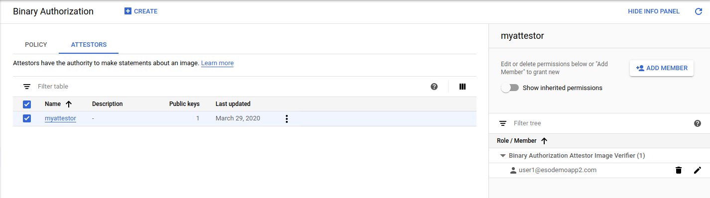
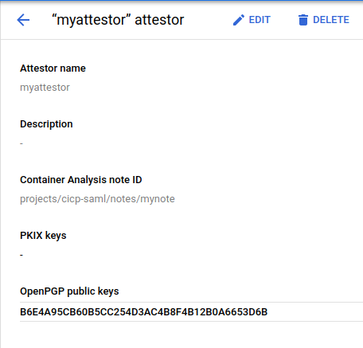
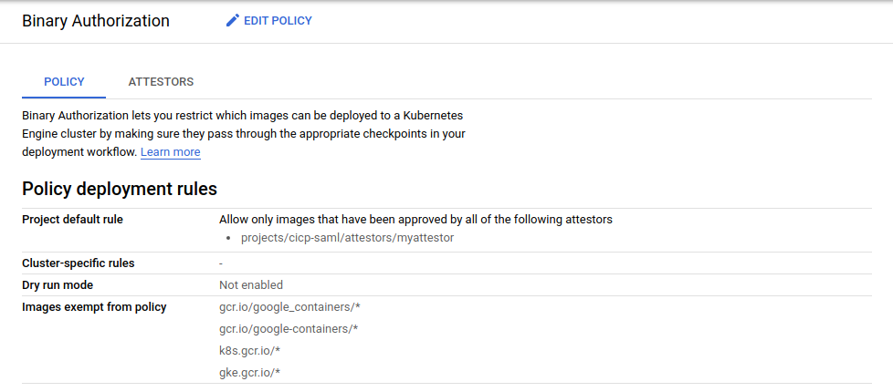

# "Binary Authorization" with Container Optimized OS

Sample procedure that deploys a container to a COS only after a binary authorization attestation was submitted.

[Binary Authorization](https://cloud.google.com/binary-authorization/docs) is geared towards GKE containers where an admission controller first checks if a candidate image's signature is has been attested for deployment by one or more parties.   

BinAuthz is a GCP hosted service and also exits as OSS ([kirtis](https://github.com/grafeas/kritis/blob/master/docs/binary-authorization.md)).  However, its geared towards Kubernetes and relies on k8s's `AdmissionController` to administratively check each candidate deployment.  

On other platforms like Compute Engine, no such deployment time controller exits so this workaround performs some of the basic tasks to emulate BinAuthz on a [Container Optimized OS](https://cloud.google.com/container-optimized-os/docs).

At a high level, the procedure basically configures a [cloud-init](https://cloudinit.readthedocs.io/en/latest/index.html) script  which when the COS image boots, it uses the binauthz APIs to check if the current image has the requisite signatures. 

If all the binauthz signatures are not present, the script will loop until all of them are present.  At that point, the container is deployed.

Applying  BinAuthz into a startup script is necessary since COS and GCE has no direct notion of a admission controller (the `cloud-init` script behaves like a controller here).  

Given that, the next step maybe to ensure how that the cloud-init script is actually part of the image that a given project must deploy (i.,e the controller here is indirect:  if a COS image has this check built in and is immutable, and if this is the only image a project is allowed to deploy, then there is a sense of verifiable enforcement.   To that end, there are several features that isn't covered in this:

- [Cos Customizer](https://github.com/GoogleCloudPlatform/cos-customizer)

This allowed for custom COS image generation where the cloud-init steps to check and verify can be built into the image itself.  

- [Organization Policy Restrict for images](https://cloud.google.com/resource-manager/docs/organization-policy/org-policy-constraints): 
  `constraints/compute.trustedImageProjects` is a list constraint defines the set of projects that can be used for image storage and disk instantiation for Compute Engine. By default, instances can be created from images in any project that shares images publicly or explicitly with the user. The allowed/denied list of publisher projects must be strings in the form: projects/PROJECT_ID. If this constraint is active, only images from trusted projects will be allowed as the source for boot disks for new instances. 

>> **Note**  The cos container-init script below uses the bin authz api and gets its creds to invoke it from the metadata server.  This means the container could also have view access to the same api.   If that is an issue you can use `gcloud secrets` or some other mechanism to bootstrap credentials only for itself or call some other endpoint to check/verify.

Anyway, 

- [Enable binary authorization](#enable-binary-authorization)
- [Allow GCE IAM permissions to BinAuthz](#allow-gce-iam-permissions-to-binauthz)
- [Create Note](#create-note)
- [Set IAM Permissions](#set-iam-permissions)
- [Create Attestor](#create-attestor)
- [Export Import Policy](#export-import-policy)
- [Build image and push](#build-image-and-push)
- [Create GCE VM](#create-gce-vm)
- [Sign Payload](#sign-payload)
- [Submit Attestation](#submit-attestation)
- [Verify Deployment](#verify-deployment)

- [cloud-init.yaml](#cloud-init.yaml)


### Enable binary authorization

```bash
export PROJECT_ID=`gcloud config get-value core/project`
export PROJECT_NUMBER=`gcloud projects describe $PROJECT_ID --format="value(projectNumber)"`
export GCE_SERVICE_ACCOUNT=$PROJECT_NUMBER-compute@developer.gserviceaccount.com
export ATTESTOR_NAME=myattestor
export NOTE_ID=mynote
export ATTESTOR_PROJECT_ID=$PROJECT_ID
export ATTESTOR_USERNAME=`gcloud config get-value core/account`
```

```bash
gcloud services enable binaryauthorization.googleapis.com  \
   compute.googleapis.com  containeranalysis.googleapis.com \
   containerregistry.googleapis.com  
```

### Allow GCE IAM permissions to BinAuthz

```bash
gcloud projects add-iam-policy-binding $PROJECT_ID  \
     --member=serviceAccount:$GCE_SERVICE_ACCOUNT   \
     --role=roles/binaryauthorization.attestorsViewer
```

### Create Note


```bash
cat > /tmp/note_payload.json << EOM
{
  "name": "projects/${PROJECT_ID}/notes/${NOTE_ID}",
  "attestation": {
    "hint": {
      "human_readable_name": "${PROJECT_ID}-${NOTE_ID}"
    }
  }
}
EOM
```

```bash
curl -X POST \
    -H "Content-Type: application/json" \
    -H "Authorization: Bearer $(gcloud auth print-access-token)"  \
    -H "x-goog-user-project: ${ATTESTOR_PROJECT_ID}" \
    --data-binary @/tmp/note_payload.json  \
    "https://containeranalysis.googleapis.com/v1/projects/${ATTESTOR_PROJECT_ID}/notes/?noteId=${NOTE_ID}"
```

### Set IAM Permissions

Set [IAM policies](https://cloud.google.com/binary-authorization/docs/reference/permissions-and-roles) so that a user can attest the image

```bash
cat > /tmp/iam_request.json << EOM
{
  'resource': 'projects/${PROJECT}/notes/${NOTE_ID}',
  'policy': {
    'bindings': [
      {
        'role': 'roles/containeranalysis.notes.occurrences.viewer',
        'members': [
          'user:$ATTESTOR_USERNAME'
        ]
      },    
      {
        'role': 'roles/containeranalysis.notes.attacher',
        'members': [
           'user:$ATTESTOR_USERNAME'
        ]
      }      
    ]
  }
}
EOM
```

```bash
curl -X POST  \
    -H "Content-Type: application/json" \
    -H "Authorization: Bearer $(gcloud auth print-access-token)" \
    --data-binary @/tmp/iam_request.json \
    "https://containeranalysis.googleapis.com/v1/projects/${PROJECT_ID}/notes/${NOTE_ID}:setIamPolicy"


gcloud projects add-iam-policy-binding $PROJECT_ID   \
    --member=user:$ATTESTOR_USERNAME  \
    --role=roles/binaryauthorization.attestorsEditor
```



### Create Attestor

```
gpg --full-generate-key
    public and secret key created and signed.
    pub   rsa4096 2020-03-28 [SC]
        B6E4A95CB60B5CC254D3AC4B8F4B12B0A6653D6B
    uid                      GCP_Attestor <gcpattestor@domain.com>
    sub   rsa4096 2020-03-28 [E]
```

GPG Key specs for prompts:
- RSA and RSA; 4096bits; keys do not expire
- name: GCP_Attestor
- email: gcpattestor@domain.com
- password: password
- Export Public/Private Keys

```bash
gpg --armor --export gcpattestor@domain.com > certs/$ATTESTOR_NAME.asc

The following steps are not needed (these just exports the keys from the local keyring)
#gpg --export-secret-keys gcpattestor@domain.com > certs/$ATTESTOR_NAME.gpg
#echo "password" > certs/$ATTESTOR_NAME.pass
```

```bash
export PUBLIC_KEY_ID=B6E4A95CB60B5CC254D3AC4B8F4B12B0A6653D6B

gcloud  beta container binauthz attestors create "${ATTESTOR_NAME}" \
    --attestation-authority-note="${NOTE_ID}" \
    --attestation-authority-note-project="${PROJECT_ID}"


gcloud beta container binauthz attestors add-iam-policy-binding \
  "projects/${PROJECT_ID}/attestors/${ATTESTOR_NAME}" \
  --member="user:$ATTESTOR_USERNAME" \
  --role=roles/binaryauthorization.attestorsVerifier

gcloud --project="${PROJECT_ID}" \
    beta container binauthz attestors public-keys add \
    --attestor="${ATTESTOR_NAME}" \
    --pgp-public-key-file=certs/${ATTESTOR_NAME}.asc
```




### Export Import Policy

```bash
gcloud container binauthz policy export  > /tmp/policy.yaml
```

Edit `/tmp/policy.yaml` and add the requireAttestationsBy settings

```bash
admissionWhitelistPatterns:
- namePattern: gcr.io/google_containers/*
- namePattern: gcr.io/google-containers/*
- namePattern: k8s.gcr.io/*
- namePattern: gke.gcr.io/*
- namePattern: gcr.io/stackdriver-agents/*
defaultAdmissionRule:
  enforcementMode: ENFORCED_BLOCK_AND_AUDIT_LOG
  evaluationMode: REQUIRE_ATTESTATION
  requireAttestationsBy:
  - projects/$PROJECT_ID/attestors/$ATTESTOR_NAME
name: projects/$PROECT_ID/policy

gcloud container binauthz policy import /tmp/policy.yaml
```



### Build image and push

```bash
$ docker build -t gcr.io/$PROJECT_ID/hello-app:latest .
$ docker push gcr.io/$PROJECT_ID/hello-app:latest
```

Note the digest value.  We will need to embed this into the cloud init script:
```
    The push refers to repository [gcr.io/mineral-minutia-820/hello-app]
    3cbafa44d2e1: Pushed 
    beee9f30bc1f: Layer already exists 
    latest: digest: sha256:f54ed9aed72ba6ad42429114a178dc06cccd5deefa3dc0131bc2b2851e680884 size: 739
```

```bash
export IMAGE_PATH=https://gcr.io/$PROJECT_ID/hello-app@sha256:f54ed9aed72ba6ad42429114a178dc06cccd5deefa3dc0131bc2b2851e680884
```


### Create GCE VM

Edit `cloud-init.yaml` and specify the image and project:

```bash
    IMAGE=gcr.io/$PROJECT_ID/hello-app@sha256:f54ed9aed72ba6ad42429114a178dc06cccd5deefa3dc0131bc2b2851e680884
    ATTESTOR=myattestor
    ATTESTOR_PROJECT=$PROJECT_ID
```

Then create an instance:

```bash
gcloud compute instances create cos-1    \
 --image-family cos-stable    \
 --image-project cos-cloud    \
 --zone us-central1-a    --scopes=cloud-platform  \
 --machine-type n1-standard-1  --metadata-from-file user-data=cloud-init.yaml
```

List Attestation

```bash
$ gcloud beta container binauthz attestations list --attestor=$ATTESTOR_NAME --attestor-project=$PROJECT_ID

$ gcloud beta container binauthz attestors describe $ATTESTOR_NAME --format="value(userOwnedDrydockNote.publicKeys.id)"
```


### Sign Payload

Now as the image verifier that was given IAM permissions earlier (in my case, its `user1@esodemoapp2.com`)

```bash
gcloud beta container binauthz create-signature-payload \
  --artifact-url=${IMAGE_PATH} > generated_payload.json

gpg --default-key gcpattestor@domain.com  \
   --pinentry-mode loopback  \
   --output generated_signature.pgp \
   --armor --sign generated_payload.json
```

### Submit Attestation


```bash
gcloud beta container binauthz attestations create \
    --artifact-url="${IMAGE_PATH}" \
    --attestor="projects/${PROJECT_ID}/attestors/${ATTESTOR_NAME}" \
    --signature-file=generated_signature.pgp \
    --public-key-id=$PUBLIC_KEY_ID
```

At this point, the COS image is running but will check if all the signatures are present.  Once all parties submit their attestations, the docker image will be pulled and run within COS

### Verify Deployment

Wait maybe 2 minutes tand SSH to COS VM and verify deployment

```bash
gcloud compute ssh cos-1

docker ps
```

You should see the candidate container running now


### cloud-init.yaml

```yaml
#cloud-configs

users:
- name: cloudservice
  uid: 2000

write_files:
- path: /var/tmp/environment
  permissions: 0644
  owner: root
  content: |
    IMAGE=gcr.io/YOURPROJECT/hello-app@sha256:f54ed9aed72ba6ad42429114a178dc06cccd5deefa3dc0131bc2b2851e680884
    ATTESTOR=myattestor
    ATTESTOR_PROJECT=YOUR_PROJECT

- path: /var/tmp/verify.sh
  permissions: 0644
  owner: root
  content: |
    apt-get install -yq  jq 
    # b/152707247
    /google-cloud-sdk/bin/gcloud components update -q
    for key in $(/google-cloud-sdk/bin/gcloud beta container binauthz attestors describe myattestor    --format=json | jq -r '.userOwnedDrydockNote.publicKeys[].id')
    do 
      COUNT=`/google-cloud-sdk/bin/gcloud beta container binauthz attestations list --attestor=$1  --attestor-project=$2  --filter="(resourceUri=https://$3 AND attestation.signatures[].publicKeyId=$key)" --format=json | /usr/bin/jq '. | length'`
      if [ $COUNT -eq 0 ]; then
        echo "PublicKeyID: $key not found in Attestation"
        exit 1
      fi
    done
    exit 0    

- path: /var/tmp/deploy.sh
  permissions: 0644
  owner: root
  content: |
    for i in {1..100}; do 
      source /var/tmp/environment 
      /usr/bin/toolbox --bind /var/tmp/:/var/tmp /bin/bash /var/tmp/verify.sh $ATTESTOR $ATTESTOR_PROJECT $IMAGE
      if [ $? -eq 0 ]; then 
        echo "Binary Authorization Succeeded"
        systemctl daemon-reload
        systemctl start cloudservice.service
        break
      else 
        echo "Binary Authorization Failed"
        sleep 60
      fi 
    done 


- path: /etc/systemd/system/cloudservice.service
  permissions: 0644
  owner: root
  content: |
    [Unit]
    Description=Start binauthz docker container
    Wants=gcr-online.target
    After=gcr-online.target

    [Service]
    Environment="HOME=/home/cloudservice"
    EnvironmentFile= /var/tmp/environment
    ExecStartPre=/usr/bin/docker-credential-gcr configure-docker    
    ExecStart=/usr/bin/docker run --rm -p 8080:8080 -u 2000 --name=mycloudservice $IMAGE
    ExecStop=/usr/bin/docker stop mycloudservice
    ExecStopPost=/usr/bin/docker rm mycloudservice

runcmd:
- /bin/bash /var/tmp/deploy.sh
```


